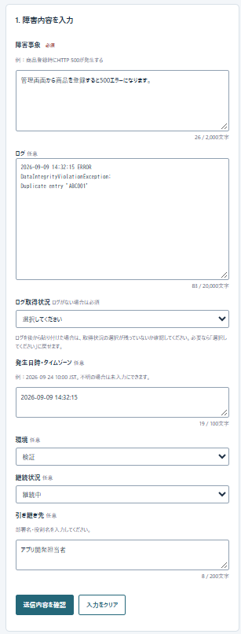
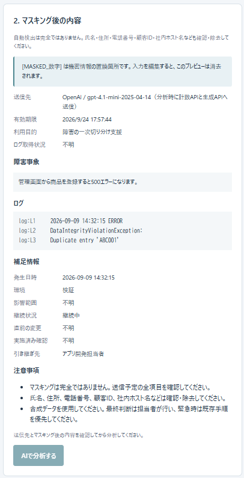
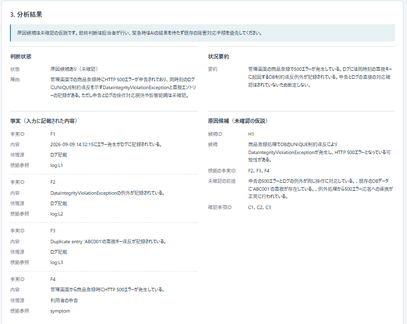
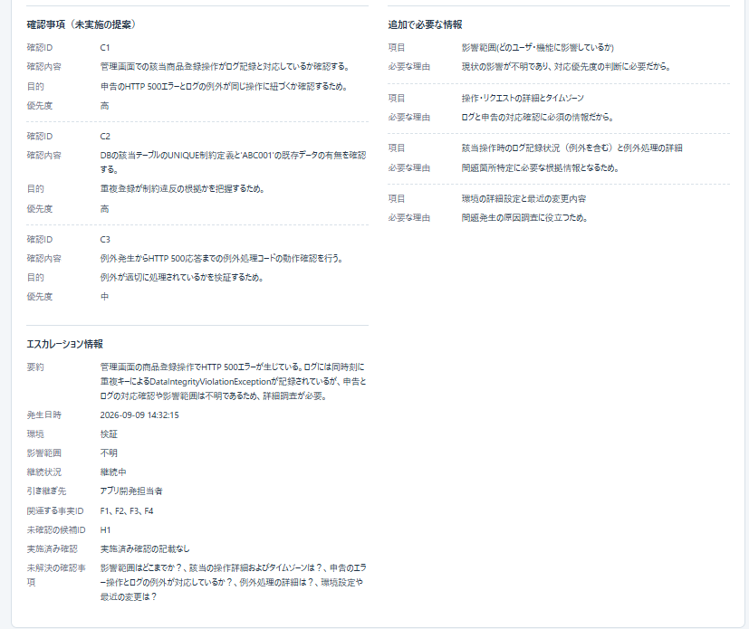
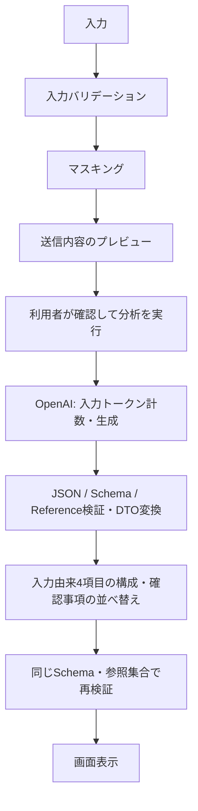

# Incident Triage Assistant

Java / Spring Boot系業務Webアプリの障害発生時に、非エンジニアを含む担当者の一次切り分けを支援する、ローカル実行向けPoCです。

障害事象・ログ・補足情報を整理し、原因候補、次に確認する事項、不足情報、エスカレーション情報を提示します。確認漏れや引き継ぎ漏れを減らすことを目指していますが、削減効果は未測定です。

**AI結果は未確認の仮説を含み、担当者が最終判断します。** 自動修復や原因の自動確定は行いません。緊急時はAIの結果を待たず、既存の障害対応・連絡手順を優先してください。入力には合成データを使用します。

## 実装済みの機能

| 項目 | 現在の実装 |
| --- | --- |
| 技術構成 | Java 21 / Spring Boot 4.1.1 / Maven Wrapper 3.9.11。静的HTML・CSS・JavaScriptを同じアプリから配信。DB不要 |
| 入力画面 | 障害事象、ログ、ログ取得状況、発生日時・タイムゾーン、環境、継続状況、引き継ぎ先 |
| 入力処理 | 必須条件・列挙値・Unicodeコードポイント数による上限検証、定義済みパターンによるマスキング |
| 送信前確認 | マスキング済み入力、ログ行ID、送信先モデル、利用目的をプレビュー。画面の「AIで分析する」を押してから外部送信 |
| AI接続 | OpenAI Responses APIと入力トークン計数API。Structured Outputsを使用し、受信後もアプリ側で検証 |
| 応答検証 | 厳密なJSON解析、JSON Schema、参照整合性検証、DTO変換。入力由来項目の構成後にも再検証 |
| 結果表示 | 判断状態・理由に加え、状況要約／事実／原因候補／確認事項／不足情報／エスカレーション情報の6系統を表示 |
| 実行管理 | 匿名セッションによるプレビュー所有権確認、有効期限、実行IDの重複拒否、全体同時実行数・時間制限 |
| 実行モード | 外部AIへ通信しないStubと、実OpenAIへの接続を切り替え可能 |

対象として想定する障害は、DB制約違反、DB接続失敗、外部APIタイムアウト、アプリケーション例外によるHTTP 500です。デモの障害元はSpring Boot＋MySQLのREST APIを想定しています。本ツールから障害元DBには接続しません。

判断状態と原因候補数は次の契約で検証します。状態の意味が入力に対して妥当かどうかは、人手評価の対象です。

| 判断状態 | 意味 | 候補数 |
| --- | --- | --- |
| `hypotheses_available` | 根拠付きの仮説を提示。原因確定ではない | 1〜3件 |
| `insufficient_information` | 情報不足により候補提示を保留 | 0件 |
| `out_of_scope` | このPoCの分析対象外 | 0件 |

## 画面で見る処理の流れ

合成データを使用したOpenAIモード（`gpt-4.1-mini-2025-04-14`）の表示例です。分析結果は前半・後半の2枚に分けて掲載しています。

### 1. 障害情報の入力

障害事象・ログと、発生日時・環境・継続状況・引き継ぎ先を入力します。



### 2. マスキング後の送信内容確認

マスキング済みの内容、ログ行ID、補足情報、送信先を確認してから分析を実行します。

この例にはマスキング対象の秘密情報を含めていないため、置換表現の表示例ではありません。



### 3. AI分析結果

判断状態、事実、未確認の原因候補、確認事項、不足情報、エスカレーション情報を確認します。表示例は回答品質を保証するものではなく、担当者による確認が必要です。

前半：判断状態・状況要約・事実と根拠・原因候補。



後半：優先度付き確認事項・不足情報・エスカレーション情報。専用入力欄の4項目が引き継ぎ情報へ反映されています。



## 処理フロー



StubモードではOpenAIへの通信部分を固定応答に置き換えます。プレビュー作成だけではOpenAIへ送信しません。OpenAIモードでは、分析時の計数APIにもマスキング済み入力が送られます。

入力を編集するとプレビューと結果を無効化します。分析に使用したプレビューは成功・失敗とも処理終了時に破棄し、再実行には新しいプレビューを必要とします。自動再試行は行いません。

## AIとコードの責任分担

### コードで処理・検証する範囲

- 定義済みパターンのマスキング、プレビューの所有権・有効期限の確認。
- JSONの型・必須項目・列挙値・長さ・件数、未知のプロパティ・null等の拒否。
- 要素IDの一意性、参照先の実在、情報源の種類と参照先の対応、判断状態に対する候補数の整合。
- 確認事項を高→中→低の順に並べ替え。同じ優先度内の順序とIDは保持。
- 次の4項目を、同一プレビューの確認済みマスキング済み入力と `SourceReferences` から構成。

| 最終結果の項目 | 転記元 |
| --- | --- |
| `escalation.occurred_at` | `context.occurred_at`（発生日時・タイムゾーン） |
| `escalation.environment` | `context.environment`（環境） |
| `escalation.ongoing_status` | `context.ongoing_status`（継続状況） |
| `escalation.destination` | `context.destination`（引き継ぎ先） |

4項目は専用入力欄の値を採用し、AI生成値で上書き・補完しません。未入力は「不明」とし、ログや障害事象から抽出しません。未提供と明示的な「不明」は参照集合で区別しますが、画面上の値はどちらも「不明」です。転記する値の切り捨て・要約・分割は行いません。

**AI応答を先に検証し、合格した応答だけを構成し直して再検証します。** 構成予定の項目でも、元のAI応答が契約違反なら拒否します。不正応答を後処理で救済せず、生応答や自由形式回答を代わりに表示しません。

実装の入口は [AnalysisService](src/main/java/com/example/triage/service/AnalysisService.java) と [TriageResultValidator](src/main/java/com/example/triage/validation/TriageResultValidator.java) です。

### AIに残る範囲

判断状態の選択、判断理由、状況要約、事実の記述、原因候補、確認事項、不足情報、引き継ぎ要約などの自由文はAIが生成します。影響範囲と実施済み確認も今回の4項目転記には含まれません。影響範囲はマスキング後に出力上限を超える可能性があり、実施済み確認は入力上限2,000文字に対して出力の1要素が1,000文字までという制約があります。

参照IDが存在しても、その参照が文章全体を裏付けるとは限りません。自由文の意味を汎用的に判定する検証器は実装していません。マスキングも全機密情報の除去を保証するものではありません。

## 評価結果とAIの限界

2026-09-24時点の自動テスト実績は **Java 254件、JavaScript 14件、合計268件成功** です。契約違反の拒否、マスキング、参照、実行制御、入力・プレビュー・最終結果の連携などを合成データで検証しています。JavaScriptテストは簡易DOMとFake HTTPを用い、実ブラウザの見た目を保証するものではありません。

実OpenAIのA/B/C評価では、画面上で期待する判断状態、情報不足時の候補抑制、対象外時の窓口案内、確認事項の優先度順を確認しました。確認済み入力で不明だった4項目は、評価した9件すべての最終表示でも不明でした。4項目の実値転記は自動テストに加え、掲載したOpenAIモードの画面例でも入力・プレビュー・最終表示の一致を確認しています。この1例だけで実値入力時の品質全般や安定性を確認したとはしていません。

一方、AI自由文には、申告とログを根拠なく「同時刻」「対応するログ」と表現する例や、ログ取得状況から調査進捗・ログの不存在を断定する例が残っています。4項目の最終表示が正しくても、AI生成文全体を合格とは扱いません。

実AI記録は画面PDFによる確認で、生JSON・HTTPステータス・検証実行記録を直接確認したものではありません。構造不正の拒否は自動テストで確認しています。B/Cの一部はログ取得状況が固定条件と異なり、同一入力3回の安定性評価には含められません。

**268件の成功はAI回答の意味的正しさを保証しません。** 根拠が記述全体を支持するか、未確認の時刻・因果関係・操作履歴を断定していないかは、人が評価します。既存の受入基準をすべて満たしたとはしていません。

- [固定品質評価と再テスト手順](docs/quality-evaluation.md)
- [実AI品質改善の対応記録](docs/quality-fix-notes.md)
- [固定ケースと人手の確認基準](src/test/resources/evaluation/cases.json)

起動時は `OpenAI prompt loaded version=triage-v1 sha256=...` を記録します。実AI再評価ではモデル、実施日時、プロンプト版・ハッシュ、固定入力条件、各基準の合否を確認してください。起動ログと照合できない実行条件は未確認として扱います。

## セキュリティ・プライバシー

- 実業務・実顧客のログ、実在者の個人情報、実際の認証情報をサンプル入力に使わず、合成データを使用します。
- APIキーはサーバー側の `OPENAI_API_KEY` 環境変数から読みます。ブラウザやリポジトリへ渡しません。
- APIキー、入力本文、AI生応答をアプリの診断ログへ記録しません。固定のエラー分類・検証項目名等を記録し、本文を含む例外を返しません。
- APIキー形式のラベル、Authorization、Cookie、パスワード、接続文字列、メールアドレスを定義済みパターンでマスキングします。氏名・住所・電話番号・顧客ID・社内ホスト名などを含め、利用者によるプレビュー確認・除去が必要です。
- プレビューは単一プロセスのメモリに保持し、有効期限は5分、最大100件。期限切れは定期処理等で削除します。匿名セッションのCookieは本文を含まず、HttpOnly・SameSite=Strictです。
- 入力・結果をDB、ファイル、localStorage等へ永続保存しません。画面のクリア・離脱・再読み込み時に表示を消去します。API応答には `Cache-Control: no-store` を付けます。
- 入力とAI出力は `textContent` で表示し、HTMLとして実行しません。AIにツール実行権限を与えず、入力中のURLから情報を取得しません。
- OpenAIへの生成要求は `store:false` を指定します。事業者側の保持・学習利用・処理地域・削除条件は、これだけでは確定しません。利用アカウントでの確認が必要です。

画面では利用者が送信内容を確認して分析ボタンを押す流れです。APIは同一セッションのプレビューIDを検証しますが、人が内容を読んだことを機械的に証明する仕組みではありません。

## 実行制限と現在の制約

| 項目 | 現在の初期値・動作 |
| --- | --- |
| 同時実行 | 全体2件。待機キューなし |
| 重複実行 | `execution_id`（UUID v4）の再利用を拒否。同一プレビューの同時分析も拒否 |
| 実行記録 | 本文なし、メモリ上で当日分を管理（Asia/Tokyo）、最大1,000件。再起動で失われる |
| タイムアウト | 処理全体60秒、OpenAIの計数・生成は合わせて最大50秒。外部側の処理・課金停止は保証しない |
| 入力制限 | 入力トークン上限32,000。事前に要求JSONのUTF-8バイト数でも保守的に制限し、通過後にAPIで計数 |
| 出力制限 | 最大8,000トークン。途中終了・出力上限到達等は成功扱いにしない |
| 費用制御 | 設定単価と入力数・最大出力数から生成前に評価し、1回の予算設定0.03 USDを超える場合は生成を拒否 |

ローカルのバイト数検査は正確なトークン計数ではなく、モデル上限以内でも入力を拒否する場合があります。計数APIが失敗した場合は推定値で生成を続行しません。費用制御は実請求額の保証や日次予算管理ではありません。モデル・単価・上限の設定は [application.properties](src/main/resources/application.properties) を参照してください。

未実装・現在のスコープ外：

- 自動修復、本番操作、原因・重大度・影響範囲の自動確定。
- RAG、社内文書検索、社内システム・監視基盤・障害元DBへの直接接続。
- ユーザー認証・顧客別アクセス制御。匿名セッションの所有権確認はログイン認証ではありません。
- 障害履歴・会話履歴の保存、継続会話による調査。
- チケット起票、通知、ファイルアップロード、URLからのログ取得。
- 引き継ぎ文面の専用コピー機能。現在はエスカレーション情報を項目別に表示します。
- 影響範囲・直前の変更・実施済み確認の専用入力UI（DTO/APIには項目あり）。
- 公開デモ用の固定サンプル受付、セッションごとの時間当たり回数制限、日次費用管理、再起動を跨ぐ実行制御。

GitHubでのソース公開を想定しており、アプリは既定で `127.0.0.1` にバインドします。公開Webサービスとしての運用準備は未完了です。仕様・実装計画には未実装の計画も含まれます。

## ローカル実行（Windows PowerShell）

JDK 21を用意し、リポジトリを取得したフォルダで実行します。Mavenの個別インストールは不要です。初回はWrapperと依存ライブラリのダウンロードにネットワーク接続が必要です。JavaScriptテストには `node:test` を利用できるNode.jsも必要です。

```powershell
cd <リポジトリを取得したフォルダ>
# JAVA_HOMEが未設定の場合、実際のJDK 21の場所を指定
$env:JAVA_HOME = 'C:\path\to\jdk-21'
$env:PATH = "$env:JAVA_HOME\bin;$env:PATH"
java -version
```

### Stubモード（外部AIへの通信なし）

```powershell
$env:TRIAGE_AI_MODE = 'stub'
.\mvnw.cmd spring-boot:run
```

[http://127.0.0.1:8080/](http://127.0.0.1:8080/) を開き、合成の障害事象を入力します。ログがない場合は取得状況を選び、任意の補足情報を入力してください。「送信内容を確認」→プレビュー確認→「AIで分析する」の順に操作します。

Stubはフロー確認用の固定応答です。事象に「ネットワーク機器の侵害調査」があれば対象外、そうでなくログに `Duplicate entry` があれば原因候補あり、それ以外は情報不足を返します。Bluetooth等を判別する実モデルの代わりにはなりません。

### OpenAIモード（外部通信・課金あり）

起動中なら `Ctrl+C` で停止します。キーはコマンドへ直書きせず、非表示の入力プロンプトから環境変数に設定します。

```powershell
$env:OPENAI_API_KEY = [System.Net.NetworkCredential]::new('', (Read-Host 'OpenAI API key' -AsSecureString)).Password
$env:TRIAGE_AI_MODE = 'openai'
.\mvnw.cmd spring-boot:run
```

リポジトリのモデル設定値は `gpt-4.1-mini-2025-04-14` です。利用前にアカウントのAPI利用条件とモデル・単価設定を確認してください。これは現在の提供状況や料金を保証する記載ではありません。

画面を開き、プレビューの送信先がOpenAIと意図したモデルになっていることを確認します。「AIで分析する」を押すと、入力トークン計数APIと生成APIへ通信します。キー未設定時や計数失敗時には生成を続行しません。

終了時は `Ctrl+C` で停止し、このPowerShellの環境変数を削除します。

```powershell
Remove-Item Env:OPENAI_API_KEY, Env:TRIAGE_AI_MODE -ErrorAction SilentlyContinue
```

### 自動テスト

```powershell
.\mvnw.cmd test
node src/test/js/analysis-display.test.cjs
node src/test/js/context-input.test.cjs
```

Java 254件＋JavaScript 14件が確認済みです。テストはStub / Fake transportを使用し、実OpenAIへの通信やAPIキーは不要です。Javaの結果は `target/surefire-reports/` に出力されます。

実AI評価は自動テストと分け、[固定品質評価の手順](docs/quality-evaluation.md)で実施します。A/B/Cを同一条件で各3回評価し、語句の一致ではなく根拠と文章の意味を人が確認します。本文・AI生応答を診断ログや評価記録へ保存せず、ケースID・実行条件・合否・失敗分類を記録します。

## ディレクトリ構成

```text
src/main/java/com/example/triage/
  api/          # HTTPエンドポイント・エラー応答
  dto/          # 入出力のrecord・enum
  service/      # プレビュー・分析・最終結果構成
  validation/   # 入力・Schema・参照検証
  masking/      # マスキング
  ai/           # Stub・OpenAI接続・要求構成
  runtime/      # メモリ上のプレビュー・実行制御
src/main/resources/
  application.properties
  prompts/      # 固定プロンプト
  schema/       # 出力JSON Schema
  static/       # HTML・CSS・JavaScript
src/test/
  java/         # JUnit・MockMvc等の合成テスト
  js/           # 画面処理のテスト
  resources/
    contracts/  # 入力と出力契約の合成例
    evaluation/ # 固定評価ケース・品質回帰例
docs/          # 仕様・実装計画・評価手順・改善記録
```

## 関連文書

- [仕様書](docs/specification.md)
- [初期実装方針](docs/implementation-plan.md)
- [入力整合性と固定品質評価](docs/quality-evaluation.md)
- [実AI品質改善の対応記録](docs/quality-fix-notes.md)
