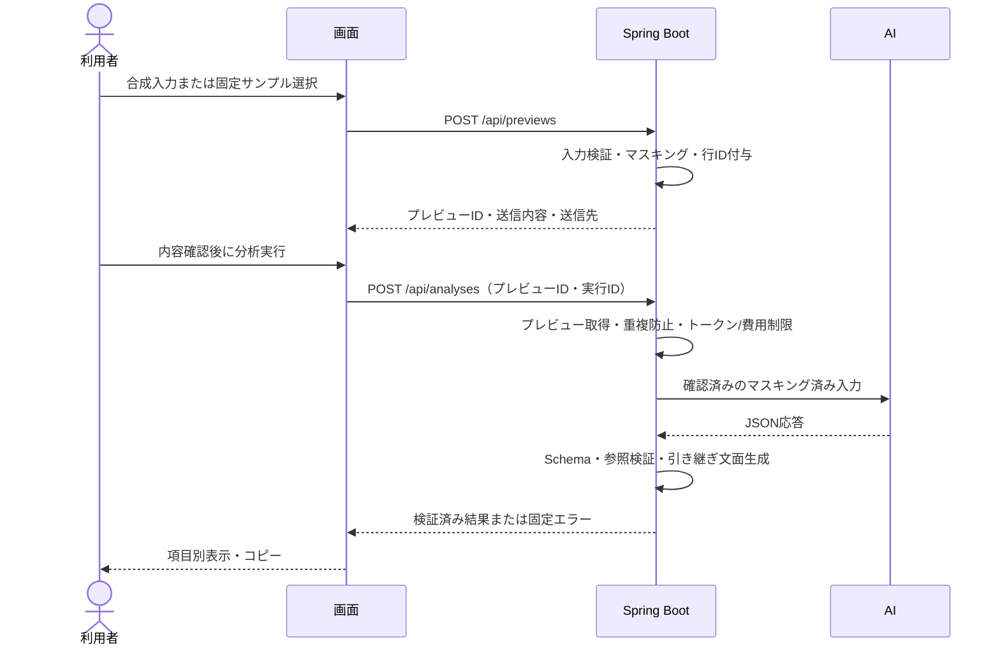

# Incident Triage Assistant 初期実装方針

## 1. 前提と実装対象

実装仕様の正は [specification.md](specification.md) とする。本書はその実現方法を定めるもので、矛盾があれば仕様書を優先する。本書作成時点ではアプリのコードは未実装。

初版は合成データによる単発分析とする。RAG、認証、履歴保存、監視基盤・チケット・通知などの外部連携は実装しない。仕様を満たすためのAI API呼び出しのみを外部通信の対象とする。

### 機能要件の抽出

| ID | 必要な機能 | 仕様書 | 初版の実現方法 |
| --- | --- | --- | --- |
| F01 | 事象・ログ・補足情報の入力 | 3・5章 | 日本語の1画面。ログなしの場合は取得状況を選択 |
| F02 | 入力制限・不明の扱い | 5章 | ブラウザとサーバーでコードポイント数・列挙値・条件付き必須を検証。未入力を創作しない |
| F03 | マスキング・送信前確認 | 5・9章 | 全テキスト項目をサーバーでマスキングし、実送信内容をプレビュー |
| F04 | 4カテゴリの分析 | 4章 | DB制約違反、DB接続失敗、外部APIタイムアウト、アプリ例外によるHTTP 500 |
| F05 | 判断保留・対象外 | 6章 | 3種類の判断状態と候補件数の制約を検証 |
| F06 | 事実・仮説・確認事項の分離 | 6・7章 | 入力根拠と未確認の前提を持つJSONを受け取る |
| F07 | 構造・参照検証 | 7章 | JSON Schema＋Javaの参照整合性検証。不正応答は表示しない |
| F08 | 結果・引き継ぎ文面 | 7・8章 | 検証済み結果を項目別に表示し、固定テンプレートでコピー文面を生成 |
| F09 | 安全な表示・非保存 | 9章 | textContentによる表示、no-store、本文ログ禁止、永続ストレージ不使用 |
| F10 | 失敗・重複実行の制御 | 10章 | 60秒上限、自動再試行なし、同一実行IDの二重実行拒否 |
| F11 | 公開デモ制限 | 9・10章 | 固定サンプルIDだけ受付。同時2、セッション5回/時、全体100回/日、日次費用上限 |
| F12 | 計測・評価 | 2・10・11章 | 本文なしメタデータ、20〜30固定ケース、AIケース各3回、自由形式回答との比較 |

利用者には「最終判断は担当者」「緊急時は既存手順を優先」「マスキングは完全ではない」を表示する。変更操作の提案、原因・影響範囲・重大度の自動確定は行わない。

## 2. 技術構成案

**Java 21＋Spring Boot＋静的HTML/CSS/JavaScriptを、単一プロセス・単一オリジンで動かす。** フロントエンド専用サーバー、SPAフレームワーク、DB、ORM、Redis、ジョブキューは導入しない。

| 用途 | 採用案 | 理由 |
| --- | --- | --- |
| 言語・ビルド | Java 21 / Maven Wrapper | Javaの業務開発経験を示し、実行手順を固定できる |
| Web/API | Spring Boot 4.1.1 / Spring MVC | 画面配信とAPIを一つのアプリにまとめる |
| UI | static/index.html、CSS、素のJavaScript | 入力・確認・結果を1画面内の状態として実装できる |
| DTO・JSON | Java record、Boot管理のJackson | JSONの名前は仕様どおりsnake_caseに固定する |
| Schema検証 | JSON Schema Draft 2020-12 / networknt json-schema-validator | 構造検証と業務上の参照検証を分離する |
| AI接続 | 単一のAiClient境界＋採用事業者1社の実装 | 初めは固定応答のStubAiClient。汎用AI基盤は作らない |
| テスト | Spring Bootのテスト基盤、JUnit、MockMvc | 契約・サービス・HTTP境界を検証する |
| 配布 | 実行可能JAR、単一インスタンス | ローカルで開始し、公開時だけHTTPSの実行環境へ配置する |

Spring Boot 4.1.1はJava 21を含むJava 17〜26に対応する。[Spring公式要件](https://docs.spring.io/spring-boot/system-requirements.html)

networkntはDraft 2020-12を扱える。依存バージョンは初回実装時にBoot側のJacksonとの互換性を確認してpom.xmlに固定する。[ライブラリ公式リポジトリ](https://github.com/networknt/json-schema-validator)

デモで想定する障害元はSpring Boot＋MySQLのREST APIに固定する。初版の分析アプリからMySQLへ接続することや、障害再現用アプリの新規開発は必要ない。まず合成ログで評価し、対象環境の前提をREADMEへ記す。

AI事業者・モデルは、JSON生成、トークン計数、料金、保存・学習利用・処理地域・削除条件を確認して実接続前に1つ選ぶ。今回の設計で未確認の事業者条件やモデル名を確定しない。最初のタスクはこの選定を待たず着手できる。

## 3. ディレクトリ構成案

```text
incident-triage-assistant/
├─ pom.xml
├─ mvnw / mvnw.cmd / .mvn/
├─ README.md
├─ docs/
│  ├─ specification.md
│  └─ implementation-plan.md
├─ src/main/java/com/example/triage/
│  ├─ TriageApplication.java
│  ├─ api/                  # PreviewController、AnalysisController、ApiExceptionHandler
│  ├─ dto/                  # 入力・プレビュー・分析結果・エラーDTO
│  ├─ service/              # PreviewService、AnalysisService、EscalationFormatter
│  ├─ masking/              # MaskingService、マスキングルール
│  ├─ validation/           # InputValidator、SchemaValidator、ReferenceValidator
│  ├─ ai/                   # AiClient、StubAiClient、実接続クライアント
│  ├─ runtime/              # PreviewStore、ExecutionGuard、UsageLimiter、MetadataRecorder
│  └─ config/               # 上限・AI設定・local/demoの入力受付設定
├─ src/main/resources/
│  ├─ application.yml
│  ├─ schema/triage-result.schema.json
│  ├─ prompts/triage-v1.txt
│  ├─ samples/              # 公開可能な固定合成入力
│  └─ static/
│     ├─ index.html
│     ├─ app.js
│     └─ styles.css
├─ src/test/java/com/example/triage/
│  ├─ validation/
│  ├─ masking/
│  ├─ service/
│  └─ api/
└─ src/test/resources/
   ├─ contracts/             # 3状態の有効JSONと不正応答
   └─ evaluation/            # 固定合成入力・期待状態・禁止事項
```

必要になったファイルから作成する。空の層や汎用Repositoryは作らない。運用時の本文なしメタデータ・予算カウンターの出力先はソースツリー外に設定し、入力・出力の保存先は設けない。

## 4. DTO / Schema設計

### 4.1 入力とAPI用DTO

AI出力契約と、画面用のリクエスト・レスポンスを区別する。画面用情報をAIのJSON契約へ追加しない。

| DTO | フィールドと用途 |
| --- | --- |
| IncidentInput | symptom、log、log_status、context |
| IncidentContext | occurred_at、environment、impact、ongoing_status、recent_changes、checks_performed、destination |
| LocalPreviewRequest | IncidentInput。localモードのみ受付 |
| DemoPreviewRequest | sample_idのみ。未知プロパティを拒否し、任意本文を受付しない |
| PreviewResponse | preview_id、expires_at、masked_input、行ID付きログ、送信先・目的・注意事項 |
| AnalyzeRequest | preview_id、execution_idのみ |
| AnalysisResponse | request_id、result（TriageResult）、escalation_text |
| ApiError | request_id、code、message、field_errors（項目IDと固定メッセージのみ） |

入力DTOの省略可能項目は未入力として受け付け、内部の正規化で「不明」にする。未入力項目は根拠参照可能な項目集合に加えない。出力DTOのnull禁止と混同しない。

入力上限は仕様5章どおり。JavaではcodePointCount、JavaScriptではArray.from(value).lengthで数える。JavaのString.lengthや標準の文字列長アノテーションだけに依存しない。ログが空ならlog_statusを必須とする。

### 4.2 AI出力DTO

Java側はrecordとenumを使い、JSON名は明示的にsnake_caseへ対応させる。DTOのtoStringや例外から本文をログ出力しない。

```java
record TriageResult(
    String schemaVersion,
    AssessmentStatus assessmentStatus,
    String assessmentReason,
    String summary,
    List<Fact> facts,
    List<Hypothesis> hypotheses,
    List<CheckItem> checks,
    List<MissingInformation> missingInformation,
    Escalation escalation,
    List<Void> references
) {}
```

referencesは初版では空配列のみ。List<Void>は空配列用の暫定Java表現とし、SchemaでmaxItems: 0を強制する。将来用のRAG DTOは実装しない。

| DTO | フィールド（JSON名） |
| --- | --- |
| Fact | id、statement、source_type、source_ref |
| Hypothesis | id、description、evidence_fact_ids、unverified_assumptions、check_ids |
| CheckItem | id、action、purpose、priority |
| MissingInformation | item、reason |
| Escalation | summary、occurred_at、environment、impact、ongoing_status、destination、related_fact_ids、hypothesis_ids、checks_performed、open_questions |

各説明フィールドはString、各ID配列・説明文配列はList<String>。source_typeはuser_report/log、priorityはhigh/medium/low、assessment_statusは仕様6章の3値に対応するenumとする。日時や環境などの出力説明フィールドは「不明」を許す文字列のままにし、仕様にない日時型制約を追加しない。

### 4.3 JSON Schema

契約ファイルはsrc/main/resources/schema/triage-result.schema.jsonの1つを正とする。Draft 2020-12、$defsによる要素定義、ローカル参照だけを使用する。外部のSchema取得は無効にする。

| 対象 | 制約 |
| --- | --- |
| 全オブジェクト | type: object、全プロパティをrequired、additionalProperties: false |
| 説明文 | type: string、minLength: 1、maxLength: 1000 |
| ID・参照 | type: string、minLength: 1、maxLength: 100 |
| 要素ID | Factは^F[1-9][0-9]*$、HypothesisはH、CheckItemはCで同様 |
| schema_version | const: "1.0" |
| 列挙値 | 仕様のenumに限定 |
| facts / hypotheses / checks / missing_information | 最大20 / 3 / 5 / 10件 |
| evidence_fact_ids / check_ids | 1〜20 / 1〜5件 |
| unverified_assumptions | 0〜5件 |
| related_fact_ids / hypothesis_ids | 0〜20 / 0〜3件 |
| checks_performed / open_questions | 各0〜10件 |
| references | type: array、maxItems: 0 |

allOf＋if/thenでhypotheses_availableならhypothesesを1〜3件、それ以外は0件に制限する。typeにnullを含めない。JSON Schemaの長さ・配列・必須制約に従う。[JSON Schema仕様](https://json-schema.org/draft/2020-12/json-schema-validation)

### 4.4 検証の順序

1. 生応答を厳格にJSON解析する。コードフェンス除去や欠落値の補完はしない。重複キー・後続の別JSONも拒否する。
2. JSONツリーをSchema検証する。DTOへ変換してから検証すると欠落とnull等を取り違えるため、先に検証する。
3. ReferenceValidatorでF/H/CのID一意性と各参照の実在を検証する。
4. source_typeとsource_refの対応を、プレビュー時にサーバーが作った入力項目・ログ行の集合で検証する。
5. 判断状態と候補件数の整合性をサービス境界でも確認する。
6. 成功時だけDTOへ変換し、画面に返す。

「不明」と正規化しただけの項目や存在しない行を、事実の根拠として参照させない。不正応答はエラーにし、通常結果への置換や自由形式へのフォールバックは行わない。

Schemaと参照検証は内容の真偽まで保証しない。根拠なし断定、命令文への追従、危険な提案、実施済み確認の創作は、プロンプト制約と仕様11章の評価で検出する。利用者が確認して使う位置付けを維持する。

## 5. 処理フロー・HTTP境界



### プレビューと実送信の一致

- POST /api/previewsは、localではIncidentInput、demoではsample_idのみを受ける。モードはサーバー設定で固定し、リクエストで切り替えられないようにする。
- マスキングはログだけでなく発生事象・補足情報にも適用する。元データと置換対応表は処理後に保持しない。
- サーバーはマスキング済みの入力、参照可能な項目集合、AI設定版を変更不可のプレビューとしてメモリに短時間保持する。提案TTLは5分、件数上限100とする。上限時は新規受付を拒否する。
- 推測困難なpreview_idを発行し、匿名のブラウザセッションへ紐づける。匿名セッションは利用制限・リクエスト対応付け用であり、ログイン認証ではない。
- 分析APIは本文を再受付せず、このプレビューを使う。画面入力を編集したら再プレビューを必須にする。期限切れは再確認を案内する。
- DELETE /api/previews/{id}でクリア時に破棄し、画面離脱時も破棄を試みる。通信不能時はTTLで削除する。分析後はプレビューを削除し、再分析には新しいプレビューを必要とする。
- 画面離脱時に画面内データをクリアし、戻る操作で復元された場合もリセットする。localStorage、sessionStorage、IndexedDB、Service Workerによる本文保存は行わない。

### AI実行と結果表示

- システム指示と入力データを分け、4カテゴリ、根拠必須、候補0件の条件、変更操作禁止をプロンプトへ記載する。入力に命令文があっても指示として採用しない。
- AiClientはマスキング済み入力だけを受け取る。実装は1社のみ、ツール呼び出し・URL取得・自動再試行なし。
- 事業者が構造化生成に対応する場合は利用するが、サーバーの完全なSchema検証は省略しない。事業者のSchema対応範囲が狭い場合もアプリの契約は緩和しない。
- 入力トークン上限、出力上限、利用制限を確認し、最大費用を予約してから呼び出す。JSON不完全・拒否・中断は通常結果にしない。
- 処理全体に60秒の期限を設け、残り時間をAI呼び出しのタイムアウトへ渡す。
- 結果は判断状態、要約、事実、仮説、確認事項、不足情報、引き継ぎ文面の順に表示する。根拠クリックでマスキング済みの該当箇所を示す。
- innerHTMLやMarkdown処理を使わずtextContentで表示する。新規実行時は前回結果をクリアし、失敗時に以前の結果を今回の結果として残さない。

### エラーと運用制御

入力不正は400、期限切れプレビューは410、重複実行は409、利用・費用上限は429、AI応答不正は502、外部障害は503、期限超過は504を基本とする。返すエラーは固定コード・固定メッセージとし、SDK例外や本文を返さない。全API応答にno-storeを付ける。

単一プロセス内の排他制御で実行IDを先に確保し、二重送信でAIが2回呼ばれないようにする。実行IDは当日の終了まで本文なしで保持し、件数上限時は新規受付を停止する。匿名セッションのCookieはHttpOnly、SameSite、公開時Secureを設定する。同一オリジンのみからJSON APIを呼べるようにし、localはループバックへバインドする。

公開デモの同時2件、セッション5回/時、全体100回/日と費用予約は一つのUsageLimiterで原子的に更新する。日付境界はAsia/Tokyoで固定する。プロセス再起動で全体回数・予約費用・重複実行情報が消えないよう、本文を含まない小さな運用状態ファイルを使用する。これは障害履歴ではない。更新を保存してからAIを呼び、状態の破損・保存失敗時は実行を停止する。複数インスタンスには展開しない。

運用メタデータは許可した項目のみのJSON Lines等で記録し、原則7日で削除する。本文、入力ハッシュ、置換対応表、SDKの生例外は記録しない。ホスティング側のアクセスログ・APMも本文を収集しないよう確認する。予算状態・重複実行情報も必要期間後に削除する。

## 6. 小さな実装タスク

| 順番 | タスク | 完了条件 |
| --- | --- | --- |
| 1 | Maven雛形＋出力契約＋検証 | 3状態の正常例が通り、不正構造・状態・参照を拒否するテストが通る |
| 2 | 入力DTO・入力検証 | 仕様5章の全項目、ログなし、文字数境界、補助文字を検証できる |
| 3 | マスキング | 全テキスト項目で指定対象を除去し、改行と同一値の対応を保持できる |
| 4 | プレビューAPI・短期メモリ管理 | 内容確認・期限切れ・クリア・demoの任意本文拒否が動く |
| 5 | Stubによる分析API | 実行IDの重複防止、検証済み応答、固定エラーを確認できる |
| 6 | 1画面UI・引き継ぎ文面 | 入力→確認→分析→結果→コピーが動き、安全に表示できる |
| 7 | 実行・費用・メタデータ制御 | タイムアウト、各上限、並行予約、再起動後の制限、本文非保存を確認できる |
| 8 | AI事業者・モデル選定 | JSON生成、料金、トークン計数、データ条件を確認し、設定と説明を確定する |
| 9 | 実AI接続 | Stubを1社の実装へ置換し、拒否・中断・障害を含めて検証する |
| 10 | 固定評価・README | 20〜30ケース、AIケース各3回、比較結果と起動手順を記録する |
| 11 | 公開デモ準備（公開する場合） | 固定サンプル、HTTPS、費用上限、外部保存条件・ログ設定を確認する |

ローカルのStubによる一連の動作確認はタスク6で可能。実AI接続と初版完了は仕様11章の受入基準を満たしてからとする。タスク7の運用制御を実AI接続後へ先送りしない。

## 7. 最初に実装する1タスク

**タスク1：AI未接続で、仕様7章のJSON出力契約を受理・拒否できる状態を作る。**

### 具体的な作業手順

1. Java 21・Mavenの実行環境を確認し、単一モジュールのpom.xml、Maven Wrapper、最小のTriageApplicationを作成する。Boot 4.1.1のWeb・テスト基盤と、互換性を確認したSchema検証ライブラリだけを追加する。
2. triage-result.schema.jsonへ仕様7章の全要素を転記する。必須、null禁止、未知項目禁止、文字数、配列件数、列挙値、references空、状態別候補件数を定義する。
3. TriageResultと下位record・enumを作成し、JSONプロパティ名が仕様と一致するよう設定する。入力・出力内容をログへ出さない。
4. SchemaValidatorとReferenceValidatorを作成する。参照検証には、呼び出し元が作る参照可能な入力項目ID・ログ行IDの集合を渡す。HTTPやAIに依存させない。
5. 仕様書の判断保留JSONをそのままテスト資材へコピーする。根拠付き候補1件と対象外の完全な正常例を追加し、対応する合成入力・参照集合も用意する。
6. 正常例を元に、必須欠落、null、未知項目、長さ・件数超過、保留なのに候補あり、候補提示なのに0件、重複ID、架空行、source_type不一致、存在しない候補・確認ID、非空referencesを不正ケースとして用意する。
7. JSON解析→Schema→参照検証→DTO変換のテストを実行する。重複JSONキーと後続JSONの拒否、DTOの再シリアライズ後のSchema適合も確認する。Windowsでは .\mvnw.cmd test を用いる。
8. READMEへテスト実行方法と「AI接続・画面は未実装」を記載し、git diff --checkで差分を確認する。specification.mdに変更がないことを確認する。

### 完了判定

3状態の正常例を受理し、列挙した不正ケースをすべて拒否できる。テストはAI APIキー・ネットワーク通信なしで実行できる（初回の依存取得を除く）。SchemaとDTOが仕様の名前・型・制約に一致し、仕様書を変更していないこと。

このタスクでは画面・マスキング・AI接続・公開環境を作らない。次のタスクから、この契約に適合する処理を小さく追加する。
